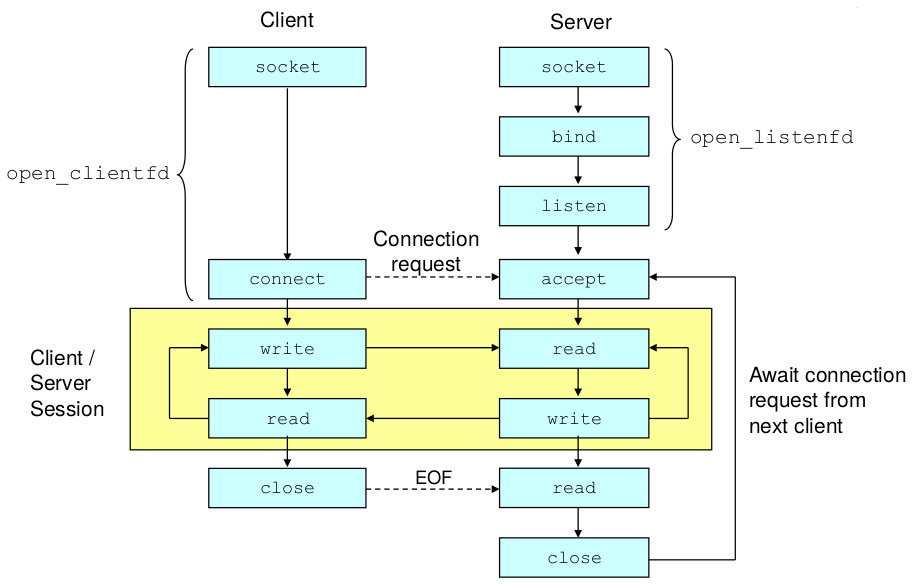
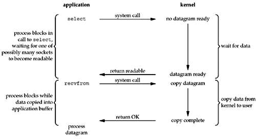

# Notes

## OSI model
- Application
  - Application protocol
- ### **Transport** (primary focus)
  - TCP protocol
- Network 
  - IP protocol
- Datalink 
  - Ethernet protocol


</br>


## BSD Socket Interface


- [Berkeley sockets](https://en.wikipedia.org/wiki/Berkeley_sockets) is an application programming interface (API) for Internet sockets and Unix domain sockets
- To the kernel, a socket is an endpoint of communication
- To an application, a socket is a file descriptor that lets the application read/write from/to the network
- Clients and servers communicate with each by reading from and writing to socket descriptors
- The main distinction between regular file I/O and socket I/O is how the application “opens” the socket descriptors


</br>


## Sockets API

### TCP Protocol
`sockfd = socket(AF_INET, SOCK_STREAM, 0)` 
- creates TCP socket
  - Returns a small integer descriptor used for identification
- It is a byte-stream protocol with no record boundaries
- Can be returned in numerous ways
  - Normally, 1 TCP segment of all 26 bytes
  - Can also be 26 TCP segments each containing 1 byte of data, etc.
- TCP connections use a three-way handshake to establish a connection
  - When handshake completes, accept returns, and the return value from the function is a new descriptor (connfd) that is called the connected descriptor
    - This new descriptor is used for communication with the new client

### TCP state transition
- The server process is put to sleep in the call to accept, waiting for connections to arrive and be accepted
- CLOSED is the state in which a socket begins when it is created by the socket function
- If an application performs an active open in the CLOSED state, TCP sends a SYN and the new state is SYN_SENT
- If TCP next receives a SYN with an ACK, it sends an ACK and the new state is ESTABLISHED

### TIME_WAIT state
- An active-close-end goes through this state
- Remains in this state is twice the maximum segment lifetime
  - MSL= max time that any IP datagram can live in a network
- Recommended value (RFC1122) is 2 min
  - BSD uses 30 sec
- TIME_WAIT duration is 1-4 min
- Packet lost is usually the result of routing problems
  - Once routing problem is corrected and the packet that was lost in the loop is sent to the final destination within MSL time

### connect functions
`int connect(int sockfd, const struct sockaddr *servaddr, socklen_t addrlen);`
- Establishes a connection with its server
    - connect initiates TCP's three-way handshake and returns only when the connection is established or an error occurs
    - Client does not have to call bind before calling `connect`

### bind functions
`int bind (int sockfd, const struct sockaddr *myaddr, socklen_t addrlen);` 
- Assigns a local protocol address to a socket
  - 32-bit IPv4/128-bit IPv6 address and 16-bit TCP/UDP port
- Servers bind their well-known port when they start
  - Kernel chooses ephemeral ports for the socket after calling `connect` or `listen` for unbounded sockets (client or server)

### listen functions
`int listen (int sockfd, int backlog);`
- Called only by a TCP server
- Converts an unconnected socket, which is assume to be an active socket, into a passive socket
- Kernel should accept incoming connection requests directed to this socket
- Moves the socket from the CLOSED state to the LISTEN state
- Specifies the maximum number of connections the kernel should queue for this socket
- Must be called before `accept`
  - Normally called after both `socket` and `bind`
- Kernel maintains two queues
  - Incomplete connection queue (SYN_RCVD)
    - Contains an entry for each SYN that has arrived from a client for which the server is awaiting completion of the TCP 3-way handshake
  - Completed connection queue (ESTABLISHED)
    - Contains an entry for each client with whom the handshake has completed

### accept functions
`int accept (int sockfd, struct sockaddr *cliaddr, socklen_t *addrlen);`
- `cliaddr` and `addrlen` arguments are used to return the protocol address of the connected peer process
- `addrlen` is a value-result argument
  - Before the call, `*addrlen` is the size of the structure pointed to by`cliaddr`
    - Contains (on return) the actual number of bytes stored by the kernel in the socket address structure
- Returns to the server the next completed connection from the front of the completed connection queue
  - If that queue is empty, the process is put to sleep (by default)

### close functions 
`int close (int sockfd);`
- Closes a socket and terminates the TCP connection


### select functions
`int select(int maxfdp1, fd_set *readset, fd_set *writeset, fd_set *exceptset, const struct timeval *timeout);`
```c
struct timeval {
    long
    tv_sec;//seconds
    long
    tv_usec;//microseconds
};
```
- TCP client establishes a connection with its server
- Tells the kernel which descriptors to test (reading, writing, or an exception condition) and how long to wait
- An object of type `fd_set` specifies on input the file descriptors to be checked for being ready

### FD_* functions
- `select` modifies the descriptor sets pointed to by these arguments


### shutdown function
`int shutdown(int sockfd, int howto);`
- SHUT_RD 
  - Read half of the connection is closed
- SHUT_WR 
  - Write half of the connection is closed
- SHUT_RDWR 
  - Read half and the write half of the connection are both closed


</br>


## [Descriptors](https://en.wikipedia.org/wiki/File_descriptor)
- Allows for concurrent servers that can communicate over many client connections simultaneously
  - Each time we receive a new request, we fork a child to handle the request

### Listening descriptor
- End point for client connection requests
- Created once and exists for lifetime of the server

### Connected descriptor
- End point of the connection between client and server
- A new descriptor is created each time the server accepts a
- connection request from a client.
  - Exists only as long as it takes to service client.


</br>


## IP Addresses
- 32-bit IP addresses are stored in an IP address struct
```c
struct in_addr {
    unsigned int s_addr;    /* network byte order (big-endian) */
};
```
- Handy network byte-order conversion functions:
  - htonl
    - Convert long int from host to network byte order
  - htons
    - Convert short int from host to network byte order
  - ntohl
    - Convert long int from network to host byte order
  - ntohs 
    - Convert short int from network to host byte order


</br>


## I/O Models
### Blocking I/O


- Datagram example
- By default, all sockets are blocking
- The process is blocked the entire time from when it calls `recvfrom` until it returns. When `recvfrom` returns successfully, the application processes the datagram

### Nonblocking I/O


- The 4th time we call recvfrom, a datagram is ready, it is copied into our application buffer, and recvfrom returns successfully. We then process the data.
- When an application sits in a loop calling recvfrom on a nonblocking descriptor like this, it is called polling.
  - The application is continually polling the kernel to see if some operation is ready. 
  - This is often a waste of CPU time
- This model is occasionally encountered, normally on systems dedicated to one function.

### I/O multiplexing


- We block in a call to select, waiting for the datagram socket to be readable. When select returns that the socket is readable, we then call `recvfrom` to copy the datagram into our application buffer
- There does not appear to be any advantage
  - In fact, there is a slight disadvantage because using select requires two system calls instead of one 
- The advantage in using select is that we can wait for more than one descriptor to be ready
- Closely related I/O model is to use multithreading with blocking I/O
  - Closely resembles the model described above
    - Instead of using select to block on multiple file descriptors, the program uses multiple threads (one per file descriptor), and each thread is then free to call blocking system calls like `recvfrom`


</br>


## Types of Server Implementations
- Iterative Servers
  - Iterative servers process one request at a time
- Concurrent servers
  - Concurrent servers handle multiple requests concurrently
    - Serves multiple clients at the same time
  - Mechanisms for concurrent flows
    1. Processes
       - Kernel automatically interleaves multiple logical flows
       - Each flow has its own private address space
    2. I/O Multiplexing
       - User manually interleaves multiple logical flows
       - Each flow shares the same address space
       - Popular for high-performance server designs
    3. Threads
       - Kernel automatically interleaves multiple logical flows
       - Each flow shares the same address space


</br>


## Distributed systems
- *A computer network is modeled by a set of n finite state machines. We call these automata processors, and say that they communicate with each other*
- We usually denote the *i*th processor in the system by P<sub>i</sub>
- Each processor can communicate with its neighbors
- Nondeterminism due to different speeds of processors and of message delivery

### Communication
- Message passing
  - Fits  wide-area distributed systems
    - Communication networks  
- Shared memory
  - Fits geographically close systems
    - Multiprocessor computers
      - Fits normally synchronous algorithms
    - Multitasking single processor
  - Assumed the the communication register architecture guarantees serialization

### Asynchronous
- Speed of processors and message transmission can cary.
- First-in first-out (FIFO) ques are used to model delivery of messages
  - Unidirectional
  - Bidirectional

### Synchronous
- A global clock pulse triggers a simultaneous step of every processor in the system

### System configuration
- Description of a distributed system at a particular time
  - Every state of every processor and the content of every queue/register


### Interleaving model
- Assumed that, at each given time, only a single processor executes a computation step (**atomic step**)
  - Consists of
    - Internal computation
      - Local computations in addition to communication operation 
      - The time at which all the local operations between two communication operations of processor occur is assumed to be immediately before the second communication operation
    - Single communication operation
      - Send/receive in message passing systems
        - **Environment step** of type loss are also included to extend the model
      - Write/read in shared memory systems
  - If processors execute steps concurrently we assume that there is no influence of one step on the other

### Fair execution 
- An execution in which every step that is applicable infinitely often is executed infinitely often
  - A step *a* is applicable to a configuration c iff there exists a configuration c' such that c --( *a* )--> c'
  - An execution is an alternation sequence of configurations and steps.
    - An configuration is obtained from the previous configuration by the execution of a previous step
  - Loss step should not be executed infinitely often


</br>


## Self-stabilization
- A self-stabilizing system can be started in any arbitrary configuration and will eventually exhibit a desired "legal" behavior
  - Legal behavior (LE) is defined by a set of legal executions
    - We define LE for a particular system and a particular task
  - Every system execution of a self-stabilizing system should have a suffix that appears in LE
- A configuration c is *safe* with regard to a task LE and an algorithm if every fair execution of the algorithm that starts from c belongs to LE
- An algorithm is self-stabilizing for a task LE if every fair execution of the algorithm reaches a safe configuration with relation to LE


</br>


## Complexity measures
Include time- and space (memory) complexity used to evaluate an algorithm.

### Time
- Asynchronous
  - The first asynchronous round in an execution E is the shortest prefix E’ of E such that each processor executes at least one step in E’, thus if E'' is the suffix of E that follows E' then E = E’E’’
  - The first asynchronous cycle in an execution E is the shortest prefix E’ of E such that each processor executes at least one complete iteration of it’s do forever loop in E’, thus E = E’E’’
    - Nullifies the speed differences of the processors
- Synchronous
  - Number of pulses in the execution, which corresponds with the number of rounds.

### Space
- Space complexity of an algorithm is the total number of (local and shared) memory bits used to implement the algorithm